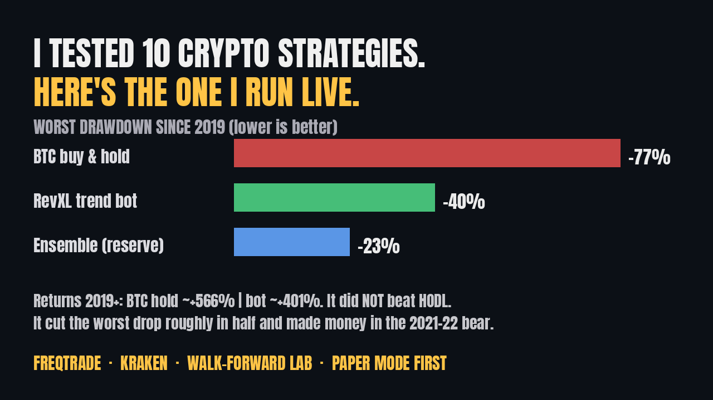

# RevXL Trend Bot (lite)

A slow, daily trend-following crypto strategy for [Freqtrade](https://www.freqtrade.io) on Kraken: BTC, ETH and SOL. MIT licensed. Ships in paper-trading mode (`dry_run`).

It is built to lose less in bear markets, not to beat holding Bitcoin. Over the test period it did not beat holding Bitcoin.



## Results (backtest, not live)

Freqtrade engine backtest, daily-signal version of the live logic, Jul 2019 to Sep 2026, 0.40% fee per side.

| | This strategy | Buy and hold BTC |
|---|---|---|
| Total return, Jul 2019 to Sep 2026 | about +401% | about +689% |
| Worst drawdown | about 40% | about 77% |
| 2021-22 bear (Apr 2021 to Dec 2022) | about +23% | about -62% |
| Aug 2023 to Sep 2026 | about +110% | about +205% |
| Sharpe ratio (Jul 2019 to Sep 2026) | 0.85 | n/a |
| Win rate | about 31% | n/a |

What the table says:

- **It did not beat buy-and-hold on return.** It gave up upside in exchange for a drawdown about half as deep, and it made money in the 2021-22 bear while BTC fell.
- A few large winners pay for many small losses (about 31% win rate). Expect long runs of small losing trades.
- In a September 2026 study it was compared against nine alternatives (BTC hold, equal-weight hold, a BTC-only trend filter, a trend basket, vol-targeted trend, momentum rotation, RSI mean reversion, a 50/50 core-satellite and a vol-targeted SMA ensemble), with out-of-sample testing from Jul 2019 and 0.5% costs per side. None clearly beat it, so it stayed the live strategy. The alternatives' code and results are not in this repo.
- Lesson from that study: a vectorized replica of this bot looked much worse than it really was. Re-run any vectorized result in the Freqtrade engine before trusting it.

Backtests are not promises. This is not financial advice.

## Rules

- Buy when the daily close is above the 50-day EMA, the 20-day EMA is above the 50-day EMA, and the close is above its 20-day average.
- Sell when the daily close drops below the 20-day EMA.
- Stop: exit when a daily CLOSE ends 15% below entry. Intraday wicks do not trigger it. A -35% exchange stop is only a catastrophe floor.
- Kill switch: after a 25% loss in about 60 days, no new trades for 14 days.
- At most 3 positions.

## Quick start (paper mode)

Requires Docker.

```bash
git clone https://github.com/johnmives/revxl-trend-bot.git
cd revxl-trend-bot
cp .env.example .env          # leave FREQTRADE__DRY_RUN=true
docker compose up -d
docker compose logs -f
python3 tests/test_daily_close_stop.py   # stop-logic regression fixtures
```

With `FREQTRADE__DRY_RUN=true` the bot simulates trades against live prices and places no real orders.

## Safety notes

- Paper-trade for at least 30 days before using real money.
- If you go live, use Kraken API keys with **withdrawals OFF** and only the trade permissions Freqtrade needs. Never commit `.env`.
- Only use money you can afford to lose. A 40% drawdown happened in the backtest and can be worse live.
- The -35% exchange stop is a catastrophe floor, not the normal exit. The normal stop is checked on the daily close, so an exit can land well past -15% on a big down day.
- Every sell is a taxable event in the US (see below).

## Taxes on bot trades (US)

2026 is the first year Kraken's Form 1099-DA can include cost basis, and only for coins bought in the same account from Jan 1, 2026, so check it before filing.

1. In Kraken, open Documents and export Trades from your first trade to today.
2. Get a quick FIFO estimate and a list of sells missing basis with the free, in-browser [Kraken tax estimator](https://jcalloway.dev/tools/kraken-crypto-tax-estimator).
3. For the actual filing (Form 8949), import the export into tax software (partner links under Support / resources below).

Not tax advice.

## License

MIT. See [LICENSE](LICENSE).

## Support / resources

Optional. The strategy above is complete and free.

- **Free:** [The Stoic Trading Journal](https://jcalloway.dev/journal) + a Sunday email with the bot's real live results, losing weeks included.
- **Pay what you want, from $5:** the [Trend Bot Kit](https://revxljohn.gumroad.com/l/trend-bot-kit) adds the walk-forward lab (10 strategies, data fetcher, results CSV), the Kraken vs Coinbase feed cross-check, the reserve ensemble strategy and a Mac 24/7 setup.
- **Check your 1099-DA:** the [1099-DA Reconciler](https://jcalloway.dev/tools/1099-da-reconciler?from=github) matches your Kraken trades against the form, flags sells missing basis and builds Form 8949 rows. Free preview, $29 per tax year for the full report.
- **Crypto tax software:** [Koinly](https://jcalloway.dev/go/koinly) or [CoinLedger](https://jcalloway.dev/go/coinledger) (code CRYPTOTAX10 for 10% off).
- Write-ups: [jcalloway.dev](https://jcalloway.dev) and [jcalloway.hashnode.dev](https://jcalloway.hashnode.dev).

Disclosure: the Koinly and CoinLedger links are partner links and the author may earn a commission. The Trend Bot Kit and the 1099-DA Reconciler are sold by the author.
